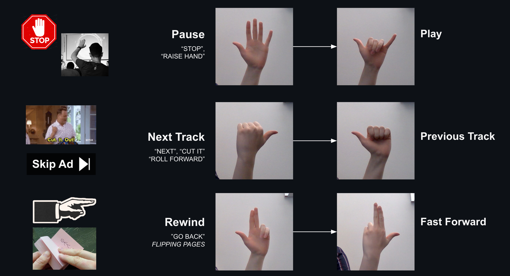
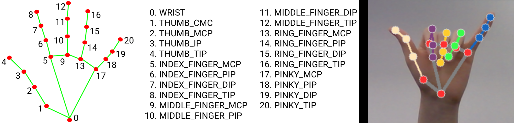

# 👋 Gestural Media Player
**Control video playback with hand gestures!**

Interaction design project to enable users to control media by performing hand gestures. 

  

This project utilizes `OpenCV` and Google's `mediapipe` for hand gesture recognition - leveraging the library's *palm detection* and *landmark labeling* models. `Flask` and `js` are used to control playback based on the gesture's respective operation.

### Choosing Hand Gestures
While introducing a new method of interaction, it was important to choose intuitive gestures that are easy to learn, remember, and do.

  

1. Pause and Play
2. Rewind and Fast Forward
3. Previous Track and Next Track

With a total of six operations, we identified three pairs that were opposites of each other. To minimize the learning curve, we initially selected three "good" gestures and then adapt them accordingly.

**Criteria for a Good Gesture**
1. Comfortable and Non Fatiguing 
2. Natural Mappings: Gestures mirror user's expectations based on the real world.   

  

### Gesture Labeling
1. The landmark labeling model by  `mediapipe hands` returns the positions.  
2. Identify closed and open fingers based on joint positions.
3. Each gesture is modeled as a funtion of closed fingers *(Gesture Equations)*

<figure align="center">
  
  <figcaption>ex. <i>Play = Open Hand - "Pointer" - "Middle" - "Ring"</i></figcaption>
</figure>

[Natural Mappings and Stimulus-Response Compatibility in User Interface Design](https://www.nngroup.com/articles/natural-mappings/)
